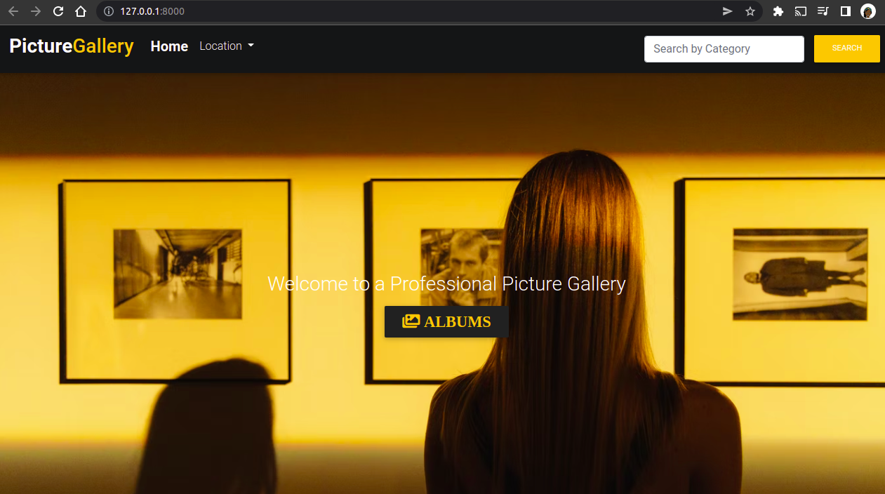

***

# PhotoGallery

---

## Author
> [Joyce Nguttu](https://github.com/joycodes)

***

## Description
>This is a Django application for a personal gallery that allows an admin to display photos for others to see.




---

## User Story  
  
* View different photos that interest them  
* Click a single image to expand it and view the details of that photo  
* Search for different categories   
* Copy a link to the photo to share with my friends.  
* View photos based on the location they were taken.  

---

## Live Link
[View Site](https://joycegallery.herokuapp.com/)

***

## Setup/Installation Requirements
To get the code..
Cloning the repository:
 https://github.com/joycodes/personal-gallery.git
  
Move to the folder and install requirements
  ```bash
  cd personal-gallery
  pip install -r requirements.txt
  ```
Setup Configurations and  Database
  ```bash 
  python manage.py makemigrations gallery 
  ``` 
Running the application
  ```bash
  python3 manage.py runserver
  ```
  
Testing the application
  ```bash
  python3 manage.py test
  ```
Open the application on your browser 
[127.0.0.1:8000](http://127.0.0.1:8000/)

---

## Dependencies
>* python3.8
>* Django 3.1.2
>* virtual environment
>* heroku
***


## Technologies Used
>* Bootstrap.
>* Python.


 
---

## Support and Contact Information
> The application is an open-source product if you  want to improve it or include an event of a bug  contact this
> https://www.linkedin.com/in/jnguttu/ .
***

## License
The project is [MIT](LICENSE) licensed 